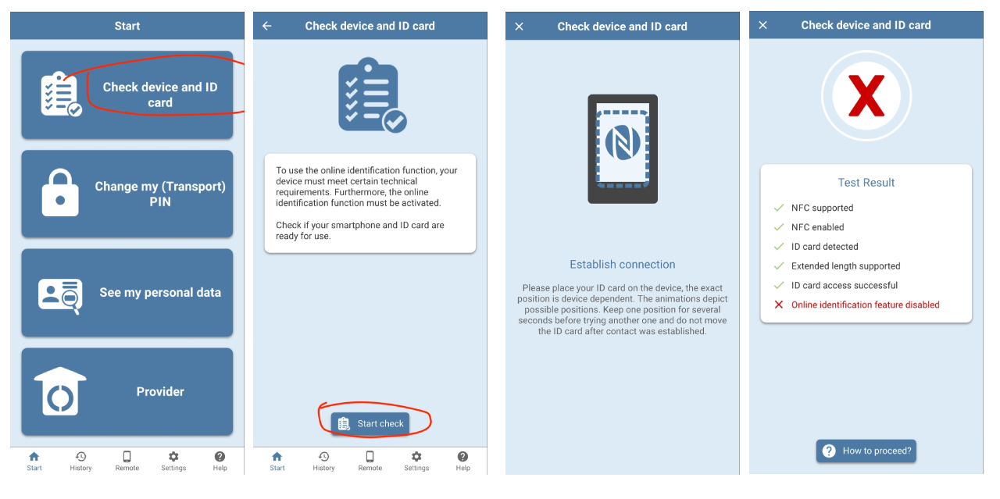
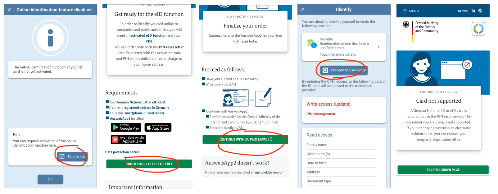
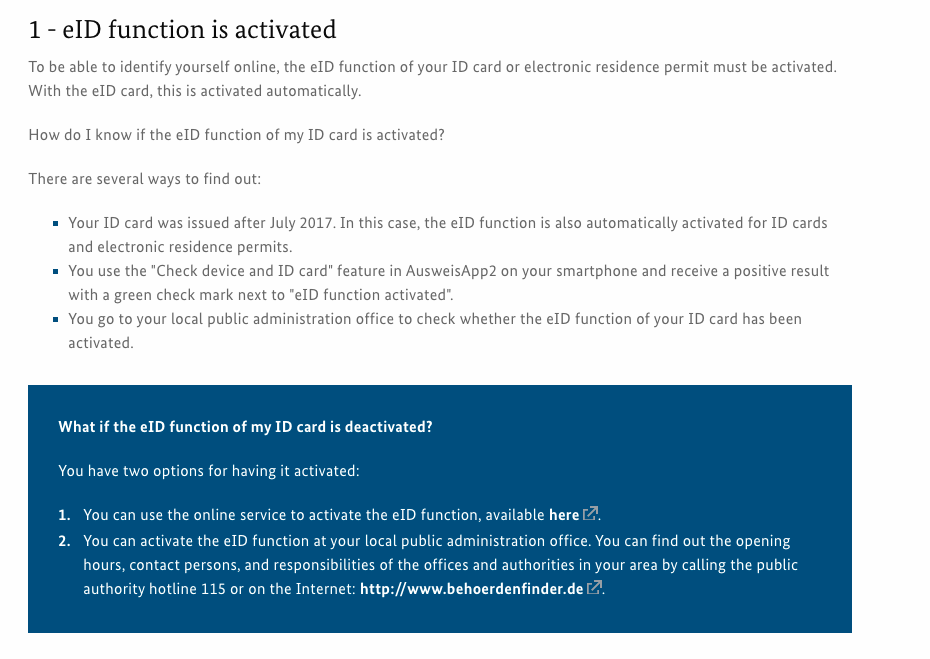

# How I applied for German PR

On 2019.03.01 I came to Germany and started my employment at Zalando.
By the 2021.12.01 I was eligible to apply for PR with A1 level.

I referred to the [Permanent settlement permit for EU Blue Card holders](https://service.berlin.de/dienstleistung/326556/en/){target=_blank} page on Berlin Service Portal to prepare the documents.

## Sent an email to Landesmt on 2022.03.20

```
To: E3@lea.berlin.de
Subject: Application for Niederlassungserlaubnis

Sehr geehrte Damen und Herren,

Mein Name ist {FULL NAME AS PER PASSPORT} und ich bin seit März 2019 in Berlin.

Ich habe eine Blaue Karte, die am {DD.MM.YYYY} abläuft.

Ich arbeite als Senior Software Engineer bei der Zalando SE und habe einen unbefristeten Arbeitsvertrag.

Hiermit beantrage ich die Niederlassungserlaubnis.

Die erforderlichen Unterlagen finden Sie im Anhang.
1. Reisepass und Blaue Karte
2. Biometrisches Foto
3.1. Arbeitsvertrag
3.2. Arbeitgeberbescheinigung
3.3. Gehaltsabrechnungen der letzten 6 Monate
4. Wohnungsmietvertrag
5. Rentenauskunft (Altersrente)
6. Krankenversicherungskarte (TK-Karte).
7. Anmeldung
8. Zertifikat Deutsch A2 - KERN

Lassen Sie es mich wissen, wenn Sie weitere Informationen benötigen.

Mit freundlichen Grüße,
Anil Bharadia
```

Details about the attachments:

`1. Reisepass und Blaue Karte`  A single PDF containing the scan copies of:
    my current passport,
    my expired passport (which is mentioned in my blue card), 
    my blue card front and back page,
    zusatsblatt that I received with my blue card

`2. Biometrisches Foto` I a took photo in my mobile and printed on a photopaper at home. I kept the paper copy for the appointment and sent the same photo's soft copy in email.

`3.1. Arbeitsvertrag` Employment contract

`3.2. Arbeitgeberbescheinigung` I donwloaded this from Zalando's employee portal

`3.3. Gehaltsabrechnungen der letzten 6 Monate` Payslips of last 6 months

`4. Wohnungsmietvertrag` Apartment rental contract

`5. Rentenauskunft (Altersrente)` Pension statement that I dowloaded from the [AusweisApp2](https://www.ausweisapp.bund.de/home/)
    - TODO: Explain how to get this

`6. Krankenversicherungskarte (TK-Karte)` Scan copy of my TK card (front and back in a single PDF file)

`7. Anmeldung` The Anmeldebestätigung I got from Bürgeramt

`8. Zertifikat Deutsch A2 - KERN` I attended the German language courses provided by Zalando via KERN. So I asked the person from KERN (who enrolled me earlier) to send me the certificate of participation. 

## Got a reply from Landesamt on 2022.04.13

```
Sehr geehrter Herr Bharadia,
 
anbei die Vorladung für die voraussichtliche Erteilung der Niederlassungserlaubnis am 05.05.2022.
Die mitzubringenden Unterlagen können Sie dem beigefügtem Schreiben entnehmen.

Mit freundlichen Grüßen
Im Auftrag
 
xxx
```

The attachment in this email was a PDF file with the following information:

- Date and time of the appointment
- The address of the appointment ([Friedrich-Krause-Ufer 24, 13353 Berlin](https://goo.gl/maps/tnF2rBKogbzd3e1Z6))
- The name of the waiting room and the Waitingnumber
- A list of docuemtns to bring
    
    Translation    
       
        I would ask you to bring the following documents with you (please also note the following page):
        - Passport
        - Employer's confirmation of an ongoing employment relationship (not older than 14 days) and proof of net earnings from 03/2022
        - Current membership certificate of your health insurance
        - Registration certificate
        - A current biometric passport photo (35mm x 45mm, frontal photo with a neutral facial expression and closed mouth looking straight into the camera, light background)
        - Fee 113.00 EUR


## Visited the Landesamt on 2022.05.05

So I went to the landesamt with the following documents

- `Passport` (in my case the current and the expired one)
- `Arbeitgeberbescheinigung`
    - I downloaded a new Arbeitgeberbescheinigung from Zalado's internal portal as it was more than 14 days since I sent it in the email.
- `Confirmation about the insurance cover with TK` Downloaded it from TK's website
- `Anmeldung`
- `Photo`

At the gate of the Landesamt, I showed the appointment PDF I got from the email mentioned above, to the security person to get into the building.

Went to the waiting room mentioned in the PDF. There were TV screens shwing the waiting nummer. When my number came I went to the mentioned room.

There was a young lady who asked me to give her the documents. I handed the documents as mentioned above.

Then she asked me the following questions in German.

    - What is your birth date?
    - Do you have siblings?
    - What are your hobbies ?

Then she asked me to go to the waiting room again, and come back when my waiting nummber apper on the TV. She kept the douments with her.

I went to waiting room and after 5-10 minutes my number appeared again so I went there again.

This time she asked me to sign on the tablet and asked me two more questions:

    - What is your height?
    - What is your eye color?

Then she printed and gave me a confirmation letter. And told me that I will get the electronic permit (card) by 4 to 6 weeks.

And then she returned me all my documents and gave me a card to pay the fee.
    
    If you are new to this: 
        It is like a credit card. That you can enter into the payment machine, 
        the machine will take it and ask to pay via your bank card.
        I went to waiting room again where there was the payment machine, 
        there I paid the fee.


The confirmation letter I got from this visit mentioned this:
    
    The production of the card can take a few weeks, so that the electronic residence permit cannot be expected to be sent before June 16, 2022.

## Got the Residence Permit on 2022.06.09
    
Got a letter with PIN on 2022.05.28

Got the PR card on 2022.06.09

## Activated the OnlineID Function of the Resident Permit 

Checked if my card is activated for the online ID function via AusweisApp2 android app.



So this confirms that online ID feature of my card is disabled. Hence I tried to activate it.


I found [here](https://www.ausweisapp.bund.de/en/online-identification/what-you-need) that there is anther way to activate, which is to visit Bürgeramt.


I booked an appointment via the [Online-Ausweisfunktion (eID) - nachträglich aktivieren](https://service.berlin.de/dienstleistung/329830/) page on Berlin Service Portal

I went to the Bürgeramt. The person from Burgeramt asked me if I received the card via mail. She said the cards sent via mail are not activated for online id function.
Also she informed that she cannot activate the card, she can only reset the PIN. To activate I need to send and email to landesamt. I need to look at the letter that came along with the card, on that letter on the top right corner there will be the email id which I should send an email to. 

(When I looked at that letter, it is also mentioned there that the OnlineId function is not activated. 🤦‍♂️)

So I sent an email to the Landesamt.
    
    Subject: Antrag auf Aktivierung der Online-Ausweisfunktion für den elektronischen Aufenthaltstitel

    Geschäftszeichen: {file number mentioned in the letter in the top right corner}

    Sehr geehrter Herr {name of the person},

    Mein Name ist Anil Bharadia (geboren am {DD.MM.YYYY}).
    Ich habe kürzlich den elektronischen Aufenthaltstitel mit deaktivierter Online-Ausweisfunktion erhalten.

    Ich habe versucht, den Aktivierungsbrief online zu bestellen, aber ich erhalte eine Meldung, dass meine Karte nicht unterstützt wird. Bitte sehen Sie sich den Screenshot unten an.
    {image.png}

    Ich habe dafür auch ein Bürgeramt aufgesucht, und die Antwort von dort war, Ihnen eine E-Mail zu schicken.

    Können Sie mir bitte helfen, die Online-Ausweisfunktion zu aktivieren?

    Ich freue mich auf deine Antwort.

    Mit freundlichen Grüße,
    Anil Bharadia


I got a reply next day morning:

    Sehr geehrter Herr Bharadia,

    ich habe Ihnen gerade einen Termin gebucht. Bitte schauen Sie in Ihrem Email Postfach nach.

    Mit freundlichen Grüßen
    Im Auftrag
    Herr {name}


There was an email for Termin (2 months in future) with the following information:

    Voraussetzungen / Erforderliche Unterlagen:

    - Bestellung des eAT ist erfolgt
        Ein Antrag auf Erteilung eines Aufenthaltstitels
    (Aufenthaltserlaubnis, Blaue Karte EU, Niederlassungserlaubnis oder
    Erlaubnis zum Daueraufenthalt-EU) muss positiv entschieden und der eAT
    bei der Bundesdruckerei bestellt worden sein.

    - Persönliche Abholung oder durch eine bevollmächtigte Person
    - Pass oder Passersatz
    - Bisheriger eAT
        Soweit vorhanden, ist der eAT zum bisherigen Aufenthaltstitel
    mitzubringen.

    - Vollmacht und Pass / Personalausweis des oder der Bevollmächtigten
        Der eAT kann durch eine bevollmächtigte Person abgeholt werden.


    Kosten:
    keine

I will update after this visit.