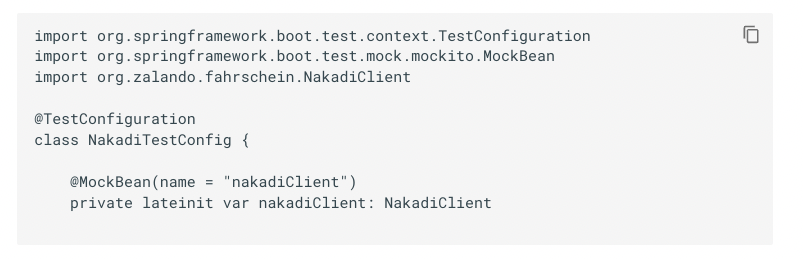
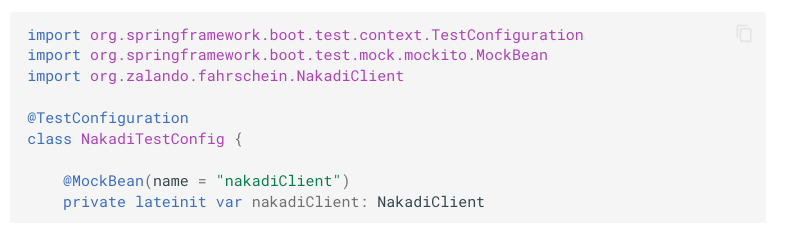

# MkDocs Material - Enable code syntax highlights

The code block in mkdocs code block are not highlighted with different colors.
All the text is shown as grey like this:



Add following lines to `mkdocs.yml`

``` yaml
markdown_extensions:
  - pymdownx.highlight:
      anchor_linenums: true
  - pymdownx.inlinehilite
  - pymdownx.snippets
  - pymdownx.superfences
```

Still it did not work.

It worked when I replaced  
````kt` 

with 

```` kotlin`




ref: https://squidfunk.github.io/mkdocs-material/reference/code-blocks/